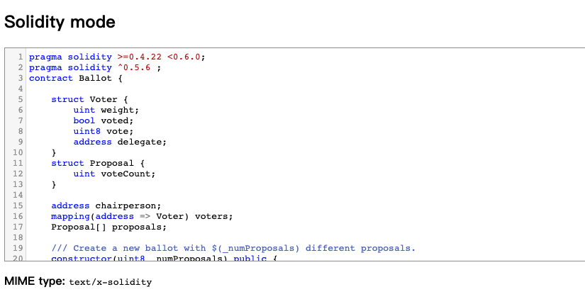

# codemirror solidity mode

[Demo](https://alincode.github.io/codemirror-solidity/)

A CodeMirror mode for Ethereum Solidity development


[](https://david-dm.org/alincode/codemirror-solidity)



## what is CodeMirror?

* <https://codemirror.net/>
* CodeMirror is a versatile text editor implemented in JavaScript for the browser. It is specialized for editing code, and comes with a number of language modes and addons that implement more advanced editing functionality.

## Installation instructions

+ Install from NPM: `npm install codemirror-solidity`
+ Include the new mode into your project, e.g.
```
<script src="./node_modules/codemirror-solidity/solidity.js"></script>
```
+ Set the mode to `text/x-solidity` in your editor, e.g.

```js
var editor = CodeMirror.fromTextArea(document.getElementById("code"), {
  theme: "solidity",
  matchBrackets: true,
  indentUnit: 4,
  lineNumbers: true,
  tabSize: 8,
  indentWithTabs: true,
  mode: "text/x-solidity"
});
```

The `index.html` file in this project includes a simple example.  Note that CodeMirror must be installed through NPM as a dependency of codemirror-solidity for that page to display correctly.

## License
MIT © [alincode](https://github.com/alincode/codemirror-solidity)